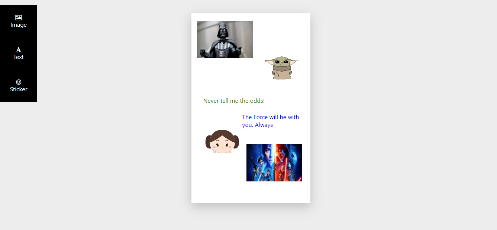

# ✨ CANVAS APP 

This is a canvas app created with react. The objective is to make a story editor where you can add a random text, image or sticker. You also can drag and drop the elements to another position.

## 🎨 Preview


[DEMO](https://nicolezimerman.github.io/canvas-react/)

## 💻 Technology
HTML, CSS, REACTJS

## 🚀 Installation

1. Clone project
2. Install the dependencies
```bash
npm install
```

## ⚙️ Usage
1. Go to project directory on the shell cd workshop-react
2. Run on the local host npm start This will be open on [http://localhost:3000]
```bash
npm start
```

## 🔨 Contributing

Pull requests are welcome. For major changes, please open an issue first to discuss what you would like to change.
